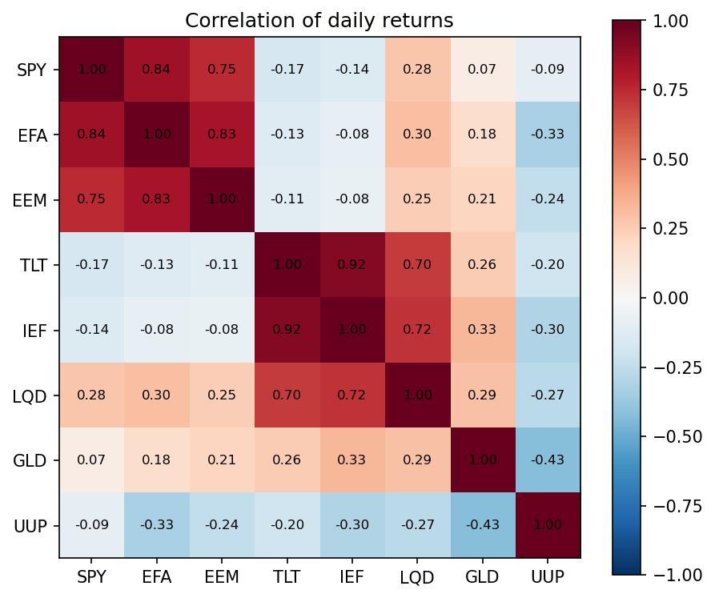
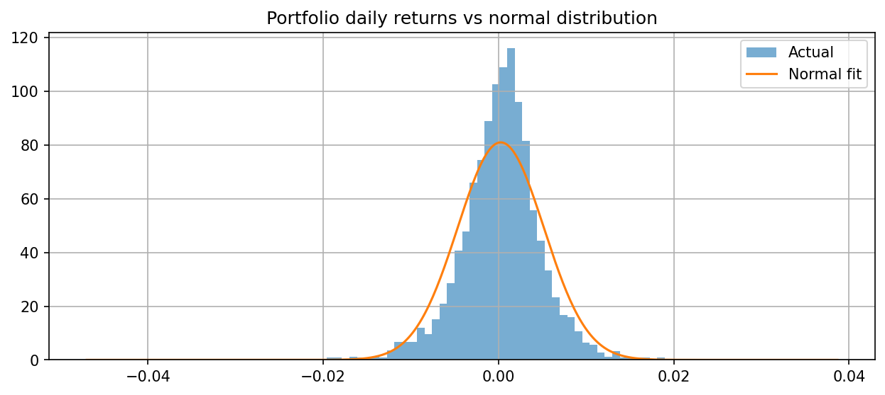
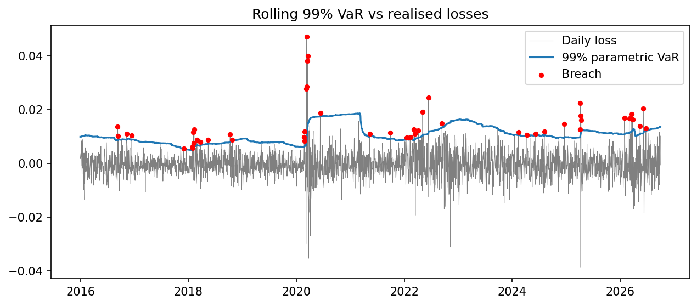

# Multi-asset portfolio risk model

I wanted to find out how much a diversified portfolio could lose in a single day, and whether the standard ways of estimating that (Value-at-Risk / VaR) hold up when you test them against real data.

## Data

Daily adjusted closing prices for eight US-listed ETFs from January 2015 to September 2026, downloaded from Yahoo Finance. Adjusted prices include dividends. The portfolio holds 12.5% in each ETF and is rebalanced daily.

- SPY : US large-cap equities (S&P 500) 
- EFA : Developed markets ex-US equities 
- EEM : Emerging-market equities 
- TLT : Long-dated US Treasuries 
- IEF : 7–10 year US Treasuries 
- LQD : Investment-grade corporate bonds 
- GLD : Gold 
- UUP : US dollar index 

## What the script does

1. Works out annual return, volatility, Sharpe ratio and maximum drawdown for each ETF and the portfolio, plus a correlation matrix. The risk-free rate is the average 13-week US T-bill yield over the period.
2. Estimates 1-day VaR and Expected Shortfall (ES) at 95% and 99% using historical, parametric (normal) and Monte Carlo methods. A bootstrap gives a confidence interval for the historical VaR.
3. Backtests VaR. Each day's forecast uses only the previous 250 days and is compared with that day's actual loss. The Kupiec test then checks whether the number of breaches is consistent with 1%.

## Results

### Performance and diversification

The portfolio's Sharpe ratio was 0.53, using a 2.07% risk-free rate. That beat six of the eight ETFs but not SPY (0.67) or GLD (0.54), both of which also returned far more per year: 13.74% and 10.89%, against 6.21% for the portfolio. Compared with SPY, the portfolio gave up more return than it saved in risk, so diversification didn't improve risk-adjusted return over this period.

Bonds were the main drag. The 2022 rate rises left TLT, IEF and LQD with Sharpe ratios of -0.23, -0.20 and 0.01.

Where diversification did help was stability. The portfolio's annual volatility was 7.82%, compared with 17.54% for SPY and 16.28% for GLD, and its worst drawdown was -19.23% against -33.72% and -26.40%. This comes from the assets not moving together. Treasuries were slightly negatively correlated with equities (around -0.15), and gold and the dollar were close to zero or negative.

SPY and gold only look like obvious picks in hindsight. Nobody in 2015 knew they would have the decade they did, and a diversified portfolio doesn't depend on guessing that.



### VaR and Expected Shortfall

At 99%, historical VaR was 1.24%. Parametric gave 1.12% and Monte Carlo 1.11%, so the two normal-based methods came in about 11% lower. For Expected Shortfall the gap was much bigger: 1.94% historical against 1.29% parametric, roughly 50% higher. At 95% the methods were close (0.74% historical, 0.79% parametric), so the normal assumption gets worse the further out into the tail you look.

The shape of the returns explains this. Excess kurtosis was 10.16, where a normal distribution would be 0. Large losses happen much more often than a bell curve allows for, and they are bigger when they do.

I bootstrapped the historical VaR to see how much it could move with a different sample of days. The 95% interval was 1.15% to 1.39%. Parametric VaR (1.12%) sits below that range, so the gap between the methods isn't just sampling noise.

In practice, a risk manager relying on the normal model would understate the loss on the worst 1% of days by about 11%, and the average loss on those days by about 50%. That means holding too little capital for exactly the days it's needed.

Monte Carlo matched parametric almost exactly, which is what you'd expect since both assume normal returns. Running 100,000 simulations makes the Monte Carlo number precise, but it can't make the inputs more accurate or fix the normality assumption.



### Backtest

Both models failed the Kupiec test at 99%. Over 2,701 days I'd expect about 27 breaches. Historical VaR had 40 (1.48%, p = 0.019) and parametric had 52 (1.93%, p < 0.001), almost double.

The historical model failing as well suggests fat tails aren't the only problem. The breaches came in clusters: historical had 7, 8 and 6 in 2018, 2020 and 2022, and parametric had 11, 9 and 9, when about 2.5 a year would be expected. 2018 and 2020 both followed calm years, so the forecast was low going in. In March 2020 the portfolio lost about 4.7% in one day, and VaR only rose after the crash. Because the 250-day window gives every day in the past year equal weight, it's slow to react when volatility picks up.

The window causes a second problem. VaR stayed high for a full year after March 2020, then dropped sharply in spring 2021. Nothing changed in the market at that point; the March 2020 days had just dropped out of the 250-day window.

A model that puts more weight on recent days should react faster. 



## Limitations

- The portfolio is rebalanced to equal weights every day with no transaction costs. Equal weighting is a simple benchmark, not an optimised allocation.
- Returns are in US dollars. A UK investor would also be exposed to the GBP/USD exchange rate.
- The ETFs were chosen in 2026, so there's some hindsight in the selection.
- The Sharpe ratio uses one average risk-free rate (2.07%) for the whole period instead of each day's rate.
- Parametric and Monte Carlo VaR assume normal returns, which the data clearly rejects.
- The fixed 250-day window reacts slowly to new volatility and causes the drop-off after crises described above.
- The bootstrap treats days as independent, so it ignores volatility clustering and probably understates how uncertain the VaR estimate is.
- Only 1-day VaR is tested.
- The prices come from Yahoo Finance through yfinance, which is not an official data source.

## Running it

```
pip install yfinance pandas numpy scipy matplotlib
python portfolio_risk_model.py
```

`prices.csv` and `irx.csv` are included so the results can be reproduced exactly. Delete them to download fresh data. Charts are saved to `figures/`.
